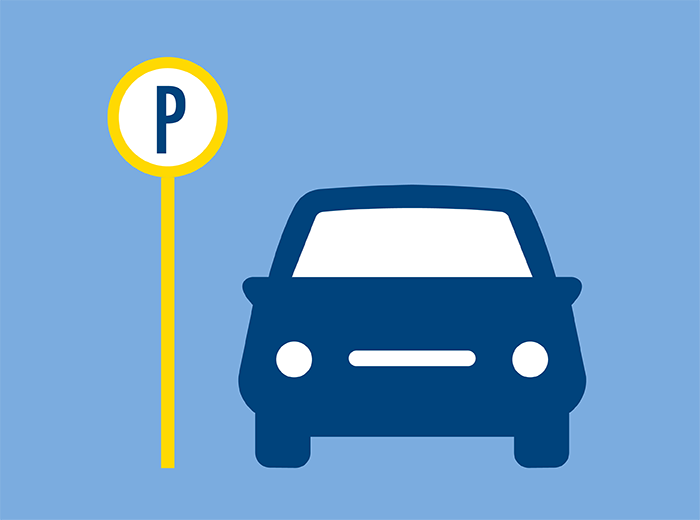

<h1 align="center">
   <br>
  <a></a>
  <br>
  <br>
  Parking service API
  <br>
</h1>

<h4 align="center">Parking service API</h4>
Parking service API based flask framework

### Start

Create environment and install requirement using [poetry](https://python-poetry.org/)
```bash
# From directory with pyproject.toml file
$ poetry update
```
And after run server


### API endpoints
```bash
# Firstly need add parking place with using POST request to this endpoint with body like this:
/add_parking_nodes
# body 
{
    "regular_nodes": [
        {
            "number_place": 1
        },
        {
            "number_place": 2
        }
    ],
    "permission_nodes": [
        {
            "number_place": 3,
            "permission": "permission1"
        },
        {
            "number_place": 4,
            "permission": "permission2"
        }
    ]
}
# In result the request you get response
{
    "success": true,
    "msg": {
    "regular_nodes": [
        {
            "number_place": 1
        },
        {
            "number_place": 2
        }
    ],
    "permission_nodes": [
        {
            "number_place": 3,
            "permission": "permission1"
        },
        {
            "number_place": 4,
            "permission": "permission2"
        }
    ]
}
}
# with status code 200 in success case or 
{
    "success": false,
    "msg": error text
}
# with status code 422 in false case
------------------------------------------------------------------------------------
# After you added parking place you can use the API
# When car came to the parking it send GET request to this endpoint with body like this:
car_come/
{
    "car_number": 1234,
    "permission": permission1
}
# permission can be None if is regular visitor
#In result this request you get response
{
    "success": true,
    "msg": "parking number is number:int"
}
# if all right or 
{
    "success": false,
    "msg": "parking has no free place"
}
# if the parking have not suitable free place

# Or in case when permission what you sent doesn't have our permission list
{
    "success": false,
    "msg": "Invalid permission"
}
------------------------------------------------------------------------------------
# When car leaving from the parking it send GET request to this endpoint with body like this:
/car_leave
{
    "car_number": 1234
}
# And get response 
{
    "success": true,
    "msg": "parking place number number:int is free"
}
# In all right case or
{
    "success": false,
    "msg": "Car number: number:int is not exist"
}

# if number of the car not exist in database
------------------------------------------------------------------------------------
# You can get all free place with send GET request to this endpoint
/get_empty_count
# and get response like this
{
    "success": true,
    "msg": {
        "free_spots": {
            "regular": 2,
            "permission": 2
        }
    }
}
```
## TODO
 - Implement booking of place
 - Implement endpoint for get number of place using number of car
 - Implement non-volatile database
## Credits

This software uses the following open source packages:

- [Flask](https://flask.palletsprojects.com/)
